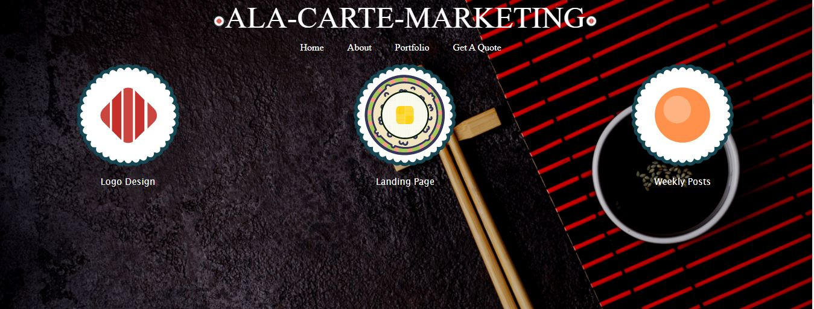
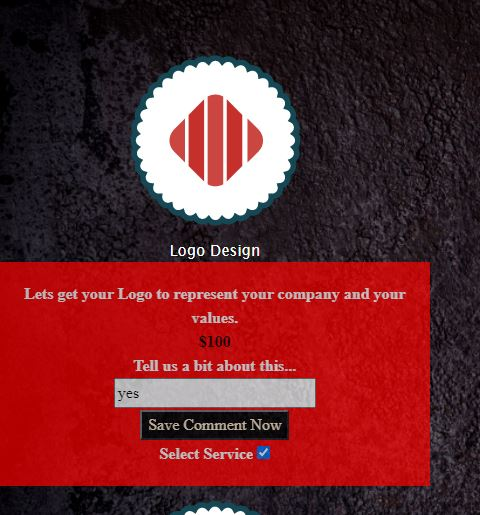
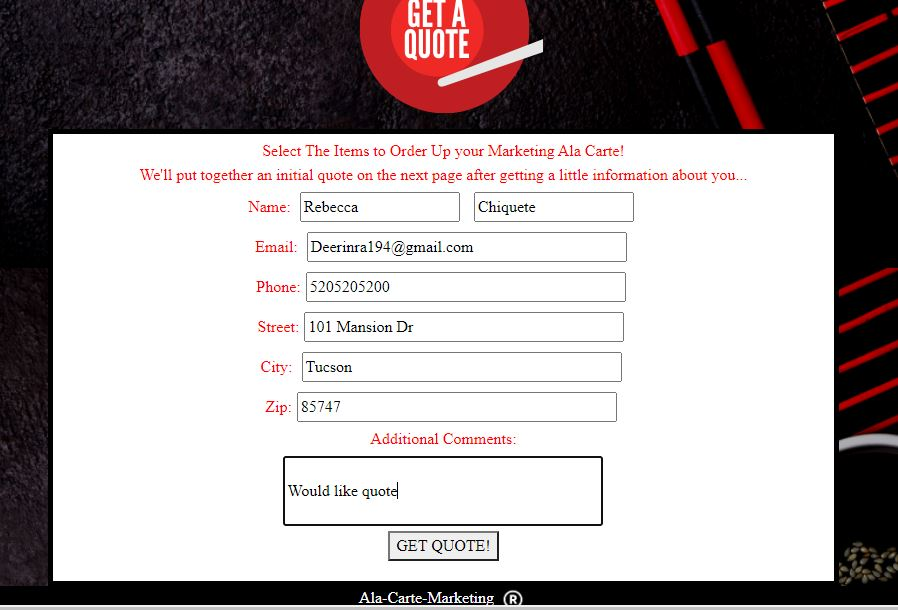
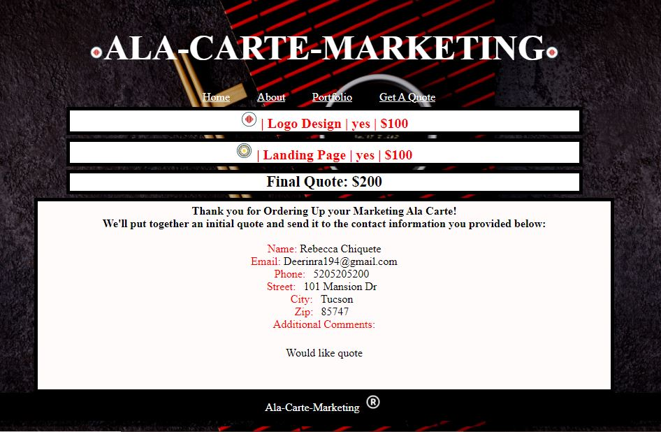
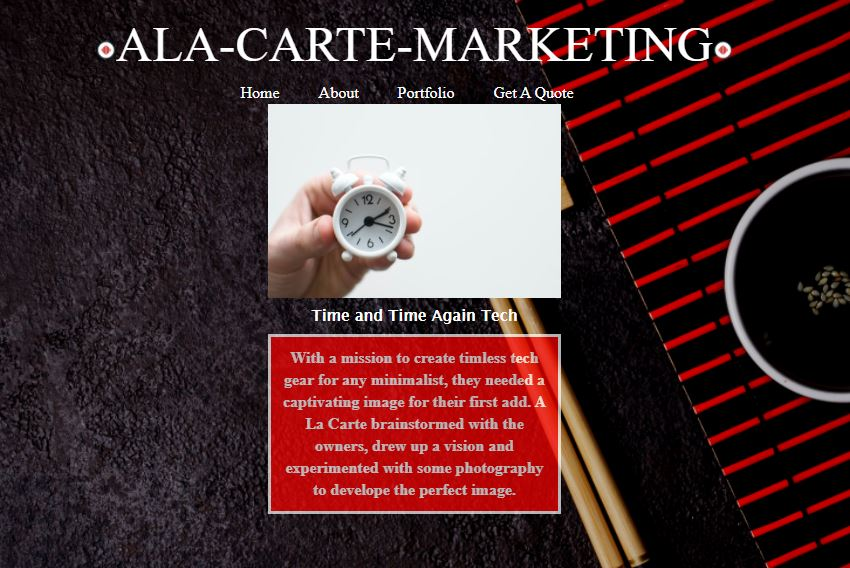
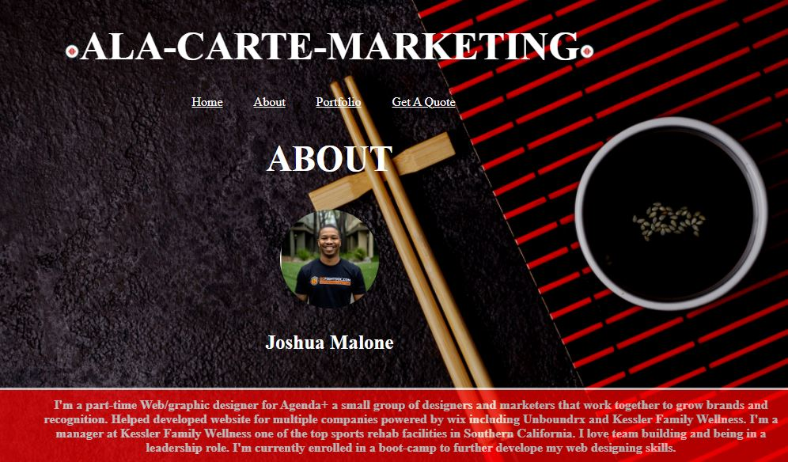

# Ala-Carte-Marketing - Skye, Josh M and Rebecca
​
# Description of Project
Ala-Carte-Marketing aligns a business with the exact marketing services they need. The buyer has an option to choose one or multiple services. Once the services are selected the buyer will receive a quote showing them their amount owed. If the buyer is unsure of the services they need, well they can just look at the portfolio page and see the last 6 pervious works Ala-Carte-Marketing has done. The idea of this service was originated from a Sushi Restaurant Theme, where you can pick whichever sushi you want, while not having to select the ones you do not want. We took this theme and ran with it!

 Enjoy!

​
# Screenshots

Main page displays icons where a customer can choose the products they like. 

   
When you click on a icon a comment box and a button to select if you would like this service will appear. 

Once you have selected your services, user will need to fill out the get a quote field. We used an API which auto fills using the Google Places Autocomplete API

Once you hit GET QUOTE you will be directed to the Quote Page where it will generate the services you selected, showing your total. It will also papulate back the infomation that the user entered. 

We created a Portfolio Page which the user can look at the most recent clients the firm has had and helped. For this we used the Unsplash API, its an API where it takes an image from a collection of images that a user has uploaded. 

Lastly we created an About me Page

# Links for the Deployed Page, and the Github Repo

[Deployed Page](https://skyelucking.github.io/Ala-Carte-Marketing/index.html)

[Github Repo Page](https://github.com/skyelucking/Ala-Carte-Marketing)
​
​

# Project Joke
Q: What did Sushi A say to Sushi B  

​A: Wasabi

